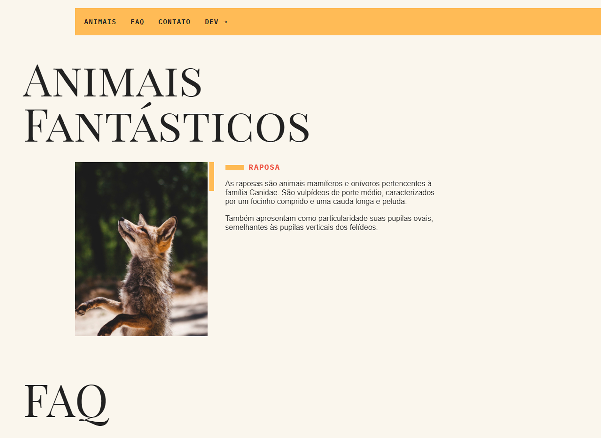

# ANIMAIS FANTÁSTICOS

Este projeto "Animais Fantásticos" é um treinamento prático de JavaScript, HTML e CSS. Ele foi criado com o objetivo de ajudar desenvolvedores a aprimorar suas habilidades nessas tecnologias, através da construção de um site interativo sobre criaturas mágicas.

## Sobre o projeto

O site "Animais Fantásticos" apresenta alguns animais, dando aos visitantes informações detalhadas sobre cada uma deles. Além disso, através de JavaScript, HTML e CSS, o pequeno projeto oferece uma experiência interativa com algumas animações.

## Tecnologias Utilizadas

- **JavaScript**: Para a interatividade e lógica do site.
- **HTML**: Estruturação do conteúdo.
- **CSS**: Estilização e animações.
